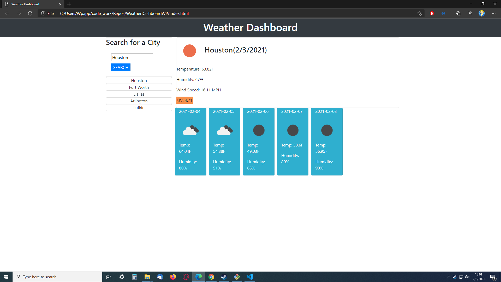

# WeatherDashboardWP
* The goal of this project was to get experience using API's to pull data and display that data when needed. 

# How to use
* The app is simple.  Just search for a city in the search bar.
* Upon submission, the user will see the current weather, including:
    * Temp
    * Humidity 
    * Windspeed
    * UV index
* The UV index will change color depending on the conidtions:
    * favorable: green
    * moderate: orange(ish)
    * extreme: red
* Also, a 5 day forcast will also show up with:
    * date
    * temp
    * humidity
* Every city that is searched will be put in the searched cites section, where the user can re-search for a city 
simply by clicking on the city name.
* The last City searched will now stay on the page even when page is refreshed.

# Link & Screen Shot

https://wrp90.github.io/WeatherDashboardWP/

